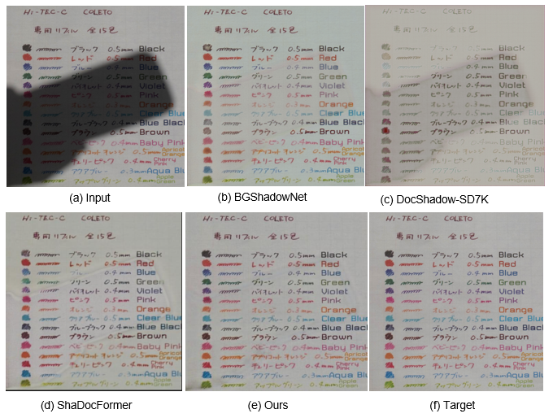

# ASMG-DARN

In International Conference on Intelligent Computing 2026(ICIC 2026)



## Usage

### Installation

```
git clone https://github.com/HuangZeLinCute/ASMG-DARN.git
cd ASMG-DARN
pip install -r requirements.txt
```

## Training

You may download the dataset first, and then specify TRAIN_DIR, VAL_DIR and SAVE_DIR in the section TRAINING in `config.yml`.

For single GPU training:

```
python train.py
```

for multiple GPUs training:

```
accelerate config
accelerate launch train.py
```

If you have difficulties with the usage of `accelerate`, please refer to [Accelerate](https://github.com/huggingface/accelerate).

## Checkpoint

[DocMaskRefine](https://huggingface.co/HuangZelin/DocMaskRefine/tree/main)


